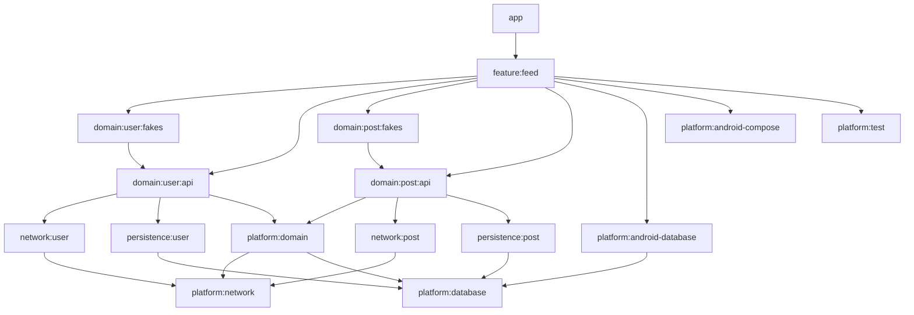

# Quack

[](LICENSE)


## Project

TBD

| Home Screen                                      | Detail Screen                                       |
|--------------------------------------------------|-----------------------------------------------------|
|  |   |

## Architecture

The Application built with my architecture library: [⚓️ Anchor](https://kioba.github.io/anchor).

## Anchor

[⚓️ Anchor](https://github.com/kioba/anchor) is my functional architecture research project based on
[Context Receivers](https://github.com/Kotlin/KEEP/blob/master/proposals/context-receivers.md).
It is developed on top of the well known unidirectional data flow (UDF) design pattern for Compose
applications and removes the boilerplate that other UDF patterns required bringing the app state
management closes to writing normal Kotlin and reducing complexity to get started.

Anchor's aim is to remove technological questions around Android and allow developers to focus on
writing an amazing apps. For this reason Anchor is highly opinionated and tries to remove the most
technical decision requirements from the app developers.

### ViewModel

ViewModels are managed by Anchor architecture library. Each `AnchorScope` has it's own ViewModel
container where the Scope and running actions are stored and makes sure that configuration changes
do not recreate them. Anchor's functionality removes the need for developers to manually create or
manage `ViewModel`s and `ViewModelFactory`s.

### Process Death

will be supported by Anchor in a later version.

### Functional Clean Architecture

TBD

## Modules

TBD

### modules graph:



## development

To build and run the app locally create a github classic token with `read:packages` access and
provide the key within `~/.gradle/gradle.properties` as following:

```
gpr.usr=<github_username>
gpr.key=<github_token>
```

read more detailed documentation on how
to [authenticate to Github packages](https://docs.github.com/en/packages/working-with-a-github-packages-registry/working-with-the-gradle-registry#authenticating-to-github-packages)

License
=======

    MIT License
    
    Copyright (c) 2023 Karoly Somodi - Kioba
    
    Permission is hereby granted, free of charge, to any person obtaining a copy
    of this software and associated documentation files (the "Software"), to deal
    in the Software without restriction, including without limitation the rights
    to use, copy, modify, merge, publish, distribute, sublicense, and/or sell
    copies of the Software, and to permit persons to whom the Software is
    furnished to do so, subject to the following conditions:
    
    The above copyright notice and this permission notice shall be included in all
    copies or substantial portions of the Software.
    
    THE SOFTWARE IS PROVIDED "AS IS", WITHOUT WARRANTY OF ANY KIND, EXPRESS OR
    IMPLIED, INCLUDING BUT NOT LIMITED TO THE WARRANTIES OF MERCHANTABILITY,
    FITNESS FOR A PARTICULAR PURPOSE AND NONINFRINGEMENT. IN NO EVENT SHALL THE
    AUTHORS OR COPYRIGHT HOLDERS BE LIABLE FOR ANY CLAIM, DAMAGES OR OTHER
    LIABILITY, WHETHER IN AN ACTION OF CONTRACT, TORT OR OTHERWISE, ARISING FROM,
    OUT OF OR IN CONNECTION WITH THE SOFTWARE OR THE USE OR OTHER DEALINGS IN THE
    SOFTWARE.
