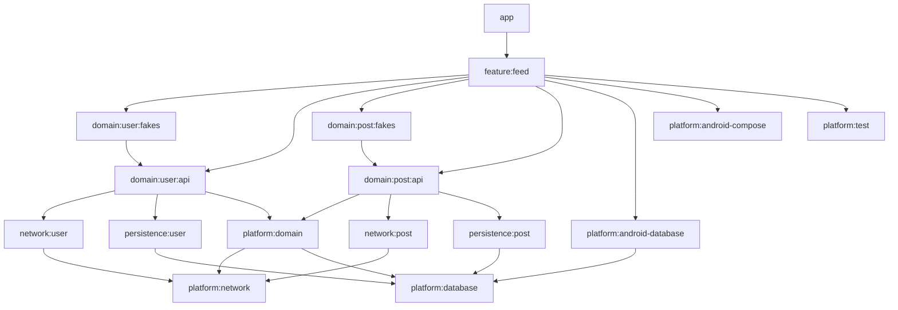

# Quack

## Project
 
  THe project contains the following features:
  - kotlin Gradle DSL
  - configured Bitrise CI build for every Pull request change
  - modularized by feature
  - Rxjava2 stream library
  - Arrow functional core data usage
  - Dagger2 dependency injection with Android extensions
  - new AndroidX libraries
  - MVI is the base architecture pattern for the view layer
  - ViewModel to persist view state data and deal with android lifecycle
  - Offline mode with Room database for persisting data
  - View logic is tested with Junit4 tests: [PostViewDataHolderTest](https://github.com/kioba/JSONPlaceholder/blob/description_update/feed/src/test/java/io/github/kioba/feed/PostViewDataHolderTest.kt), [FeedViewModelTest](https://github.com/kioba/JSONPlaceholder/blob/description_update/feed/src/test/java/io/github/kioba/feed/FeedViewModelTest.kt), [DetailViewModelTest](https://github.com/kioba/JSONPlaceholder/blob/description_update/detail/src/test/java/io/github/kioba/detail/DetailViewModelTest.kt)
  - RecyclerView with visitor pattern for the ViewHolder logic testing
  - Custom Fragment Transition added for better user experience
  - ConstraintLayout for usage for the layouts

  missing features:
  - Android Navigation component
  - identify out of sync data for better network usage
  - improvements for UI design
  - motion-layout animations
  - filtering the main screen list

  issues:
 - The project compiles with Gradle console commands but there could be some issues with Android Studio resolving the kotlin gradle files

| Home Screen                 | Detail Screen                 |
|-----------------------------|-------------------------------|
|  |  |

## MVI

The Architecture base on my Context Receivers based MVI architecture for Kotlin and Compose applications [⚓️ Anchor](https://github.com/kioba/anchor).

Anchor 

## ViewModel

## Modules
The project is using a feature based module structure. Because Google deprecated the `com.android.feature` gradle module
 configuration we will use the suggested `com.android.library`gradle config. This structure does not let the apps to be 
 released as an Instant App and won't allow dynamically delivered features but does not limit the possibility of it in the future.

The reason behind the library based module are that it introduces the module concept with the smallest complexity.
With the approach the dependency injection and code visibility is straight forward whereas in a dynamic feature module 
these concept can increase the development time.
### modules graph:

## Proguard

Proguard file is applied based on [Jemshit Iskenderov](https://gist.github.com/jemshit) [gist](https://gist.github.com/jemshit/767ab25a9670eb0083bafa65f8d786bb).
The proguard file is filtered according to the project need.
